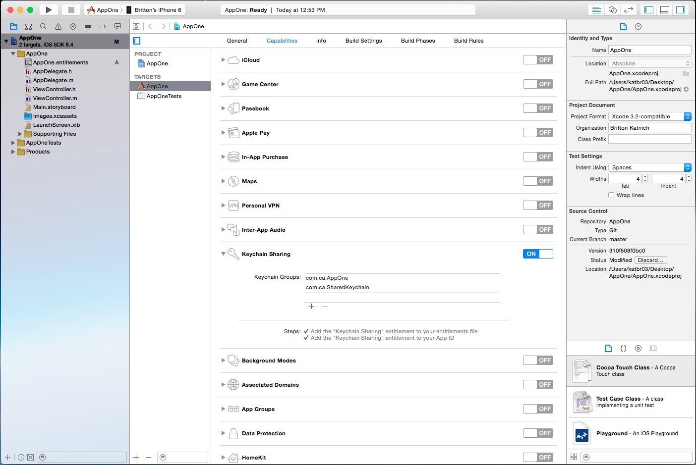

# MASFoundation

[](https://thesource.l7tech.com/thesource/Matterhorn/client-sdk/ios/trunk/Connecta)

This MAS Foundation contains the basic classes that are shared among other frameworks.

This framework is part of the  **iOS CA Mobile App Services SDK.** Other frameworks in the SDK include:

- [MASConnecta](https://github-isl-01.ca.com/MAS/iOS-MAS-Connecta)
- [MASIdentityManagement](https://github-isl-01.ca.com/MAS/iOS-MAS-IdentityManagement)
- [MASStorage](https://github-isl-01.ca.com/MAS/iOS-MAS-Storage)
- [MASUI](https://github-isl-01.ca.com/MAS/iOS-MAS-UI.git)

## Installing By Manually Importing the Framework

1. Open your project in Xcode.
2. On your ```Project target```, go to the ```General``` tab and import the framework in the ```Embedded Binaries``` section.

## Usage

Import the `MASFoundation.h` header file to any class that you want to use, or to the `.pch` file if your project has one.

```
#import <MASFoundation/MASFoundation.h>
```

### Prerequisites
- A properly configured and running CA Mobile API Gateway (MAG) 
- A client application record on the MAG is created (using OAuth Manager tool)
- The JSON file (msso_config.json) from that application record is exported, and is added to your XCode project (so it becomes part of the application's main bundle)  

**Note: JSON file requirements**
- The file contents must be in valid JSON format and have the required data 
- You can rename the .json configuration file, but you must use the .json extension. For example, 'myConfig.json' is valid. If you rename the file, you must set the custom name of the configuration file before you start the framework's processes. See Optional Settings below.

[Sample msso_config.json file with valid content and structure](./ReadMe/msso_config.json)

### Start up

The framework's default use case is simple and straightforward: the application uses the client credentials flow, and therefore no user interaction is required to register the device.  Also, The application is standalone and not part of a suite of other sibling applications.  It is not sharing keychain access to share credentials between application, therefore no additional setup is required in that respect.

For applications using this default scenario the developer only needs to do the following:

```
#import "AppDelegate.h"

#import <MASFoundation/MASFoundation.h>


@implementation AppDelegate

- (BOOL)application:(UIApplication *)application didFinishLaunchingWithOptions:(NSDictionary *)launchOptions
{
	//
	// Start MAS
	//
    [MAS start:^(BOOL completed, NSError *error)
    {
   	     ... that is it!!  The application and the device should be registered with the default Client Credentials 
         flow barring any error ...
    }];

    return YES;
}

@end
```
On installation, the above code snippet should result in registration of the application/device with MAG on the Gateway using the client credentials flow.
However, there is an alternative way to register the application/device that requires user interaction.

On subsequent startups of the application, this will validate that previously stored credentials are present and still valid.  If they are, then nothing further happens the application is ready to begin.  If not, this process will update those credentials.

### Device Registration ###

MASFoundation supports two types of device registration.

**Device registration without user credentials (Client Credentials Flow)**

This type of registration does not require any user credentials to register the device, and results in 'anonymous' user authentication. 

This is the default device registration flow and the code in the Start Up section above would utilize it and register the device without any user interaction. 

**Device registration requiring user credentials (User Credentials Flow)**

This alternative type of registration requires user credentials to register the application/device.  It will also automatically authenticate a specific user with the given credentials.  This is typically used when your application is required to restrict the registration of the application/device to specific authorized users.

To enable User Credentials Flow requires a few extra steps:

- Your class must implement the MASDelegate protocol
- Your class must set itself as the delegate **BEFORE** calling [MAS start …]
- Your class must then implement the MASDelegate methods to indicate your application requires the User Credentials Flow and can handle the credentials retrieved from the user.

Assuming you were doing this in your application's AppDelegate it would look like this:

```
@interface AppDelegate () <MASDelegate>

@end


@implementation AppDelegate

#
# pragma mark - Lifecycle
#

- (BOOL)application:(UIApplication *)application didFinishLaunchingWithOptions:  (NSDictionary *)launchOptions
{
  	//
    // Set the delegate
    //
   	[MAS setDelegate:self];
    
   	//
    // Start MAS
    //
    [MAS start:^(BOOL completed, NSError *error)
	{
   		...
   	}];
}
	
#
# pragma mark - MASDelegate
# 
	
- (MASRegistrationType)masRequestsRegistrationType
{
    return MASRegistrationTypeUserCredentials;
}

- (void)masRequestsBasicCredentials:(MASBasicCredentialsBlock)basicCredentialsBlock
                orAuthorizationCode:(MASAuthorizationCodeCredentialsBlock)authorizationCodeBlock
{     
    //
    // Basic Credentials have been requested (this should always be 
    // the case when this is called
    //
    if(basicCredentialsBlock)
    {
        ... Request the username and password from the user in some fashion ...
        
        // Once you have the credentials .. call the block like so
        basicCredentialsBlock(user, password, NO);
    }
}
	
@end
```                                          


##### Notifications

Optionally, you can observe the lifecycle notifications of the application registration, device registration and user authentication. These notifications are defined in [MASConstants](./MASFoundation/MASConstants.h) as shown below:

```
MASApplicationWillRegisterNotification
MASApplicationDidFailToRegisterNotification
MASApplicationDidRegisterNotification

MASDeviceWillRegisterNotification
MASDeviceDidFailToRegisterNotification
MASDeviceDidRegisterNotification

MASUserAuthenticationIsRequiredNotification
MASUserWillAuthenticateNotification
MASUserDidFailToAuthenticateNotification
MASUserDidAuthenticateNotification
MASUserWillUpdateInformationNotification

```

##### What happens when your application starts?  

On initial installation of your application, the following happens:
- Loads information in the .json file 
- Configures the networking and starts the connection
- Validates the application to receive and store application-level credentials 
- Depending upon the device registration type, registers the device to receive and store device-specific credentials, and optionally authenticates the user, and receives and stores user specific credentials

On subsequent start ups of an already-installed application, the process is repeated. However, if the stored credentials are still valid, the validation and/or registration to the server is not necessary and is skipped. It checks only that currently-stored credentials are still valid, and requests a refresh (if necessary).

### Optional Settings

The following optional settings can be configured before starting the framework.

##### Custom Named Configuration File

To use a custom named configuration file:

```
#import "AppDelegate.h"

#import <MASFoundation/MASFoundation.h>


@implementation AppDelegate

- (BOOL)application:(UIApplication *)application
    didFinishLaunchingWithOptions:(NSDictionary *)launchOptions
{
	//
	// You MUST do this before calling start for it to take effect.
	// Calling it after does nothing and results in it looking 
	// for the default named file when start is called.
	//
	// Also, it doesn't matter if you include the file extension or
	// not. It only looks at the filename portion and enforces the
	// .json extension internally.
	//
	[MAS setConfigurationFilename:@"customConfig"];
	
    //
    // Start MAS
    //
    [MAS start:^(BOOL completed, NSError *error)
    {
        ... 
    }];

    return YES;
}

@end
```
##### Important!

A valid configuration file is required. If the default file or custom-named file is not found, an error message is reported and your application will not run.  


##### Shared Keychain

A common use case is sharing secure credentials amongst more than one application using the same MAG.  To do this you must first enable your own application by selecting the main project, the main application target, select the Capabilities tab, enable the Key Sharing option. 

Then you must add two groups:

First, one specifically for your application in the first slot.

Secondly, a shared keychain group identifier after the first.  

Note the prefix of the identifier must match prefix of the bundle identifier of the app and all apps to share in this keychain must have their bundle identifiers match this prefix as well.

For example, if the first app is called AppOne with a bundle identifier of 'com.ca.AppOne'.  Another app that wants to access the shared keychain is name AppTwo, it must have a bundle identifier of 'com.ca.AppTwo'.

The shared keychain group identifier you specify in both apps must be the same and with the same prefix as the participating apps, ie 'com.ca.{some shared group name}'.  Below is a screenshot showing an example in one of the apps:   



That's it!!  The MASFoundation framework detects your shared keychain group settings (or not, if not set) and respond accordingly.

##### Network Monitoring

[MAS](./MASFoundation/MAS.h) is always monitoring the network reachability status of the MAG URL.  If your application needs monitoring, you can hook your application into this monitoring as follows:

```
#import "AppDelegate.h"

#import <MASFoundation/MASFoundation.h>


@implementation AppDelegate

- (BOOL)application:(UIApplication *)application
    didFinishLaunchingWithOptions:(NSDictionary *)launchOptions
{
	//
	// You can set the MAG monitor block like this.  It is recommended 
	// to set this before starting MAS
    //
	[MAS setGatewayMonitor:^(MASGatewayMonitoringStatus status)
    {
        ... do something ...
    }];
    
	//
    // Start MAS
    //
    [MAS start:^(BOOL completed, NSError *error)
    {
        ... 
    }];

    return YES;
}

@end
```

##### Notifications

You can register the MAG to monitor status update notification.  This notification is defined in [MASConstans](./MASFoundation/MASConstants.h) as shown below:

```
MASGatewayMonitorStatusUpdateNotification
```

##### Conveniences

To determine if the network connection to the MAG is currently reachable:

```
[MAS gatewayIsReachable];
```

To determine the current status as a string at any time:

```
[MAS monitoringStatus]
```


### What else can I do?

The top level classes that you can interact with are:

[MAS](./MASFoundation/MAS.h) (described previously)

In addition to starting things, you can:

##### Stop and Reset the device

To stop all processes in the framework, use the following method:

```
+ (void)stop:(MASCompletionErrorBlock)completion;
```

To reset all application, device, and user credentials in memory, or in the local and shared group keychains, use the following method:  

```
+ (void)resetWithCompletion:(MASCompletionErrorBlock)completion;
```

Note: Use this feature with caution because it may not be easy for end users to use if you make it publicly available.  We suggest a warning UI component or similar to indicate to the user exactly what they are doing, with a confirmation before proceeding with this action.

Note: This only resets the credentials on the device. To reset and deregister the device record on the MAG, call [MAS deregisterCurrentDeviceWithCompletion:].

Note: You must restart your app to get new registration of the application, device and user authentication.

##### Deregister device on the MAG

This removes the device's record from the MAG.
```
+ (void)deregisterCurrentDeviceWithCompletion (MASCompletionErrorBlock)completion;
```
Use this feature with caution because it may not be easy for end users to use if you make it publicly available.  We suggest a warning UI component or similar to indicate to the user exactly what they are doing, with a confirmation before proceeding with this action.

Note: You must restart your app to get new registration of the application, device and user authentication.

To listen for the following notifications:

```
MASDeviceWillDeregisterNotification
MASDeviceDidFailToDeregisterNotification
MASDeviceDidDeregisterNotification
```

##### Authentication

To authenticate a user with basic credentials:

```
+ (void)authenticateWithUserName:(NSString *)userName
                        password:(NSString *)password
                      completion:(MASUserResponseErrorBlock)completion;
```

To listen for the following notifications:

```
MASDeviceWillDeregisterNotification
MASDeviceDidFailToDeregisterNotification
MASDeviceDidDeregisterNotification
```

To logoff a currently-authenticated user using an asynchronous request:

```
+ (void)logoffWithCompletion:(MASCompletionErrorBlock)completion;
```

To listen for the following notifications:

```
MASUserWillLogoffNotification
MASUserDidFailToLogoffNotification
MASUserDidLogoffNotification
```


##### Straight HTTP Requests

If you have custom endpoints installed on the MAG, you can make direct and secure https calls to them.

###### The endpoint

The endpoint passed to these methods should be a fragment relative to the base URL of the MAG where the endpoints are hosted.  For example, if your full endpoint url is https://somegatewayhost:port/some/endpoint you should only pass the /some/endpoint fragment.  The MASFramework should already be setup for network connection to the base URL.

###### The parameters

Parameters are encoded according various standards defined for the HTTP verb type.

###### The headers

Headers only need to be those that are custom to a call, if any.  The MASFramework will add any necessary security credentials internally.

###### The response type

Typically the response type is JSON, but you can also set it to XML if desired per the MASRequestResponseType enumeration in [MAS](./MASFoundation/MASConstants.h).

###### The completion block 

The MASResponseInfoErrorBlock block defined in [MAS](./MASFoundation/MASConstants.h) returns (NSDictionary *responseInfo, NSError *error).

Within the responseInfo are two keys:

```
// The key for the header info dictionary that was returned in the response:
MASResponseInfoHeaderInfoKey

// The key for the body info dictionary that was returned in the response, if any:
MASResponseInfoBodyInfoKey
```

###### The request methods

This method makes HTTP DELETE calls to an endpoint.

Parameters are encoded into the endpoint URL as query parameters.

```
+ (void)deleteFrom:(NSString *)endPointPath
    withParameters:(NSDictionary *)parameterInfo
        andHeaders:(NSDictionary *)headerInfo
      responseType:(MASRequestResponseType)responseType
        completion:(MASResponseInfoErrorBlock)completion;
```

This method makes HTTP GET calls to an endpoint.

Parameters are encoded into the endpoint URL as query parameters.

```
+ (void)getFrom:(NSString *)endPointPath
     withParameters:(NSDictionary *)parameterInfo
         andHeaders:(NSDictionary *)headerInfo
       responseType:(MASRequestResponseType)responseType
         completion:(MASResponseInfoErrorBlock)completion;
```

This method makes HTTP POST calls to an endpoint.

Parameters are encoded into the HTTP body.

```
+ (void)postTo:(NSString *)endPointPath
    withParameters:(NSDictionary *)parameterInfo
        andHeaders:(NSDictionary *)headerinfo
      responseType:(MASRequestResponseType)responseType
        completion:(MASResponseInfoErrorBlock)completion;
```

This method makes HTTP PUT calls to an endpoint.

Parameters are encoded into the HTTP body.

```
+ (void)putTo:(NSString *)endPointPath
    withParameters:(NSDictionary *)parameterInfo
        andHeaders:(NSDictionary *)headerInfo
      responseType:(MASRequestResponseType)responseType
        completion:(MASResponseInfoErrorBlock)completion;
```

##### The Data Models

[MASConfiguration](./MASFoundation/MASConfiguration.h) the model for easily retrieving information provided by your configuration file programmatically.

[MASApplication](./MASFoundation/MASApplication.h) the model for viewing information about the application specific to MAS.

[MASDevice](./MASFoundation/MASDevice.h) the model for viewing information about your device within this application that is specific to MAS.

[MASUser](./MASFoundation/MASUser.h) the model for authenticating a user to access protected resources as defined on your MAG.
